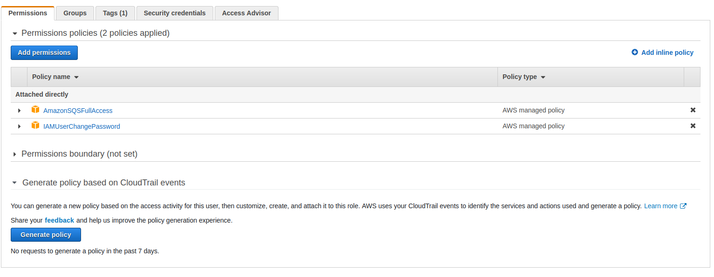
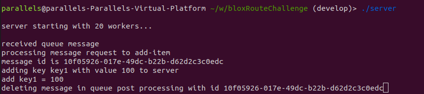
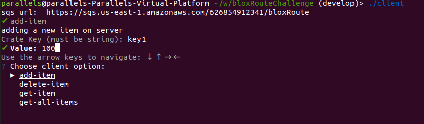

# bloxRouteChallenge

# Prerequisites
This application relies on Amazon Simple Queue Service. In order to run and build this application, one must configuring an AWS SQS and have access to an IAM AWS Account. 
Follow these instructions to setup any Amazon Prerequisites.

1. [Creating IAM User Account](https://docs.aws.amazon.com/sdk-for-go/v1/developer-guide/setting-up.html). Follow the instructions in this link under the section labeled
*Get Your AWS Access Keys*. You will need to get the *Access Key ID* and *Secret Access Key* associated with your account. This could be an existing IAM account or a new
one you have created. Here is another link in case the other link was not clear enough [Creating AWS account (IAM)](https://docs.aws.amazon.com/AWSSimpleQueueService/latest/SQSDeveloperGuide/sqs-setting-up.html)
2. [Creating Amazon SQS](https://docs.aws.amazon.com/AWSSimpleQueueService/latest/SQSDeveloperGuide/sqs-configure-create-queue.html). Follow this tutorial to create an amazon SQS. Once you have 
created your SQS, please save your SQS URL. This youtube tutorial was helpful for me to create this queue and verify that it was working with a few send/receive examples. 
[YouTube SQS tutorial](https://www.youtube.com/watch?v=5wxC6O1X440)
3. Add SQS Permissions to your IAM account. Follow this YouTube tutorial to add SQS Full User Permissions to your IAM account. [SQS Permissions IAM account](https://www.youtube.com/watch?v=20tr9gUY4i0). Once you have this step completed, your IAM account login should look like this: 

4. In total, once you have finished this setup you should have 4 bits of information: *sqsURL*, *aws access key*, *aws secret key*, *aws region*. This information is needed in the 
application configuration file.
5. You need to have an install of go 1.18 or above. Follow this to install go [go install](https://go.dev/doc/install)

# Setup Config file 
In order for both the server and client to run, there needs to be a config file. By default, this is stored in the working directory of the project as a file named *config.yml*. There is a *templateconfig.yml* stored in the repository as to not share aws credentials. 

		serverLogPath: "serverLog/"
		defaultLogPath: "defaultLogPath/"
		sqsURL: "mySQSURL"
		awsAccessKeyID: "myAWSAccessKey"
		awsSecretKeyID: "myAWSSecretKey"
		awsRegion: "us-east-1"
		serverIdleInterval: "100"
		numServerWorkers: "20"

*serverLogPath* = file where server logs are stored

*defaultLogPath* = file where any other logs are stored

*sqsURL* = sqs url obtained from following the steps in prerequisities

*awsAccessKeyID* = aws access key obtained from following the steps above

*awsSecretKeyID* = aws secret key obtained from following the steps above

*serverIdleInterval* = millisecond interval for server idle time. There is a default value for this, does not need to be specified

*numServerWorkers* = how many worker threads are going to be used on your server. There is a default value for this, does not need to be specified

# Running the application 
In a linux shell, run 
`./build.sh`
This should give you two binaries, *client*, and *server*

You can run the server by executing
`./server`

You can run the client by executing 
`./client`

##### Note: There is no real limitation on how many clients can be created and ran at the same time!